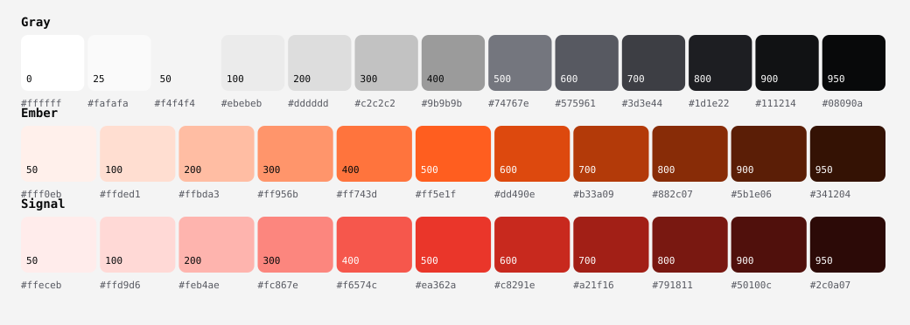

Codesavory builds small, private tools that make you look forward to something: a match, a note, a job, a render. The design language is **monochrome with one hot accent**: greys, near-black and white do all the work, and a single ember orange (or signal red) carries every moment that matters. Instrument-panel precision, dot-matrix numerals, mono captions, hairlines. Premium because it is restrained.

## Philosophy

1. **Reduce until it is one thing.** If a colour, border or word does not help someone find the next moment, remove it. Greys, black and white are the material. The accent is the spark.
2. **One spark per screen.** `accent` appears where attention should go (the seed, the live countdown, the main button) and nowhere else. It is the same orange in light and dark so the brand never changes with the theme.
3. **Instrument, not decoration.** Dot-matrix digits, mono labels and hairline grids come from hardware (Nothing, teenage engineering): honest, exact, a little playful. Geometry shows time and progress; it is never ornament.
4. **Dark is a place, light is a page.** Dark is near-black with glass and a single hot light source (Raycast). Light is calm paper with soft ink. Both are designed, neither is an inversion.
5. **Colour is a setting, not a decision.** Components never name a colour. They name a role (`surface`, `ink`, `accent`). A palette swaps the accent in one line, a language version swaps everything, and every product follows.
6. **Private and plain.** No dark patterns, no pressure, no tracking. Say what happens in short sentences. Fonts and assets are self-hosted, so the page never phones home.

References that shaped this are in `REFERENCES.md`.

## Content fundamentals

- Write the way a knowledgeable friend talks: short, direct, concrete. Contractions are normal ("it's", "don't", "you're").
- Sentence case everywhere: buttons, titles, menu items. Product and team names keep their own capitals.
- Name the result on controls: "Show my matches", "Set a reminder", "Delete my saved copy". Never "OK", "Submit" or "Continue" alone.
- Lead with the answer. The home screen says "Augsburg vs Bayern, in 2d 17h", not "Welcome back!".
- Numbers are numerals ("2 teams", "9:30 AM EDT", "63'"). Durations are compact: `2d 17h`, `42m`.
- No exclamation marks, no emoji as decoration, no ALL CAPS except the `label` style and Badge words.
- Never use em dashes, en dashes or double hyphens as punctuation. Split the sentence, or use a colon, comma or parentheses.
- Avoid: "delve", "leverage" as a verb, "seamless", "robust", "comprehensive", "unlock the power of".
- Errors say what went wrong and how to fix it: "Couldn't send. Try again in a moment." Not "Oops! Something went wrong."
- Privacy statements are facts: "No ads. No accounts. No cross-app tracking." and "We keep a one way hash of your Google id and your team list. No email, no name."

Real copy to match: "When is my next match?", "Use popular picks", "Skip and show all matches", "Your teams are synced across your devices".

## Visual foundations

### Colour

Three ramps and a role layer. **Gray** (cool, near-black to white) is the structure. **Ember** (orange) and **Signal** (red) are the accents. **Basil** (green) is for success only. Components use roles, never ramp steps.

| Role | Meaning |
|---|---|
| `surface`, `surface-raised`, `surface-sunk`, `surface-inverse` | Page, cards, wells and fields, hero panels |
| `ink`, `ink-muted`, `ink-subtle`, `ink-inverse` | Text, secondary text, placeholders, text on inverse |
| `line`, `line-strong` | Hairlines, control borders |
| `brand`, `on-brand` | Primary solid (black in light, white in dark) and its text |
| `accent`, `accent-ink`, `accent-text` | The spark, text on it, and accent used as text on a surface |
| `live`, `success`, `info` (+ `-subtle`, `-text`) | Status, always with a word or icon |
| `focus` | Keyboard ring, 3:1 on every surface |

- The accent is the same in both themes. Dark `accent-text` lightens (ember-300) so it stays readable on near-black.
- **Palettes** change the accent only: `ember` (default), `signal`, `graphite` (no colour, greys only). Set `data-palette` on the root element. Each palette passes the same contrast pairs in both themes (`dl check`).
- Text pairs are 4.5:1 or better; control borders, the focus ring and meaningful marks are 3:1 or better. Status never relies on colour alone.
- No gradients on flat UI surfaces or text. Gradients are for material only: a metal edge or disc, the studio floor behind a product (see `docs/material-language.md`). Raycast style light streaks are retired. No pure `#000` text; ink is `gray-950`.
- Team crests and colours are the only other colours on a football screen, and only on team elements.

### Type

One modern, minimal family does the work, plus a dot-matrix face for the moments that matter. **Geist** (`display` and `text`) sets headings, team names and everything you read, with tight tracking on large sizes. **Geist Mono** (`data`) sets numbers that tick or line up: the countdown, the kickoff time, the score, versions.

- Headings use `display-*` and `title-*`; body copy uses `body-l`, `body`, `body-s`; uppercase tags use `label` (always with its letter spacing).
- **Doto** (`dot`, dot-matrix) sets one countdown or score per screen, never body text. Numbers that change or align use `data-l`, `data-m` or `data-s` with tabular figures.
- Keep running text near 65 characters wide. Headings use balanced wrapping.
- One `display-xl` per page at most. On phones, step the scale down one level (`display-l` becomes `display-m`).

### Space, shape, elevation

- 4px grid. Use `space-1` to `space-9`. Whitespace separates; hairlines (`line`, 1px) rarely do. Content width 720px reading, 1000px marketing and dashboards.
- Large soft radii and full circles: pills for buttons, chips and segmented controls; `radius-xl` for cards and hero panels; round for crests, the ring and the seed. On Apple platforms use continuous corners. Nest radii: inner = outer minus padding.
- Depth is tonal first (`surface-raised` over `surface`). Shadows are neutral black and soft. In dark, shadows become a hairline top highlight; the only glow is the accent glow behind the primary button and hero.
- Floating nav is a glass pill: translucent `surface`, 18px blur, hairline border.

### Material

Since 1.3.0 the language has a material layer: brushed silver (`steel-*`, `metal-*`), cognac leather (`leather-*`, `stitch`), bone paper (`surface-warm`), a quiet serif (`serif`) and studio shadows (`shadow-product`, `shadow-edge`). It comes from the owner's reference feed: one machined object on a calm ground, lit from the top left. Rules and recipes are in `docs/material-language.md`. Leather is a material, never a second accent.

### The ring, the seed and imagery

- **The Ring** is the signature: a ring of dots that fills clockwise from 12 o'clock as a moment approaches, carrying the **seed**, an accent dot riding the end. Dot-matrix countdown text sits inside it.
- **Following** is shown by the seed (a 9px accent dot), never a star or heart.
- **The mark** is an open ring (a C) in `ink` with the accent seed in the gap (see `core/marks`). Products keep the ring and change what it measures.
- No stock photography. Hero art is built from light streaks, grain, dots and rings. Icons are 24px, 1.75px stroke, round caps, `currentColor`; SF Symbols on Apple platforms.

### Motion

Motion explains change. One orchestrated moment per screen at most. Curves `ease-whistle` (default), `ease-settle`, `ease-roll`; durations `dur-instant`, `dur-quick`, `dur-base`, `dur-slow`, `dur-ring`. The seed pulses on a 2.4s loop; LIVE breathes. Under `prefers-reduced-motion`: no sweeps, pulses or parallax, final values only. For motion pieces at 30 fps: instant 2 frames, quick 5, base 8, slow 14, ring 27; hold the final frame 12 frames.

### States and accessibility

Hover shifts a fill one step; press scales to 0.97; disabled is 45% opacity. Focus is a solid 3px `focus` outline, never removed. Touch targets 44px; body 15px, nothing under 12px. Both themes are designed, not inverted.

## Using it

**Web.** Load the generated `tokens.css` (includes `@font-face` for the self-hosted fonts and the palette blocks). Themes: `data-theme="light|dark"` or the `.dark` class. Palettes: `data-palette`. Map Tailwind or component colours to roles (see Kickoff's `globals.css`), never to hex.

**Apple apps.** The generated `DesignTokens.swift` exposes `DS.Palette.<role>` as dynamic light/dark colours, plus `DS.Space`, `DS.Radius`, `DS.Duration`. Colours in views come only from `DS.Palette` (or a thin `Theme` that forwards to it).

**Motion tools.** Hex values are in `core/tokens.json`. Ground `gray-950`, text `gray-50`, one accent `ember-500`. Use the easing and frame counts above. The Ring is a circle of dots from 12 o'clock with a 12px seed.

**Swapping the look.** Change a palette override, a ramp or a role in `core/` (or an app overlay in `apps/<name>/`), run `dl check`, then `dl sync`. Every consumer regenerates. No component edits.

## Products

- **Kickoff** (football): the next-match panel with the dot ring and a dot-matrix countdown; followed teams carry the seed; live is the only red. The Mac menu bar icon is the ring itself. See `apps/kickoff/DESIGN.md`.
- **Other Codesavory apps** keep the tokens and change what the ring measures. Do not add a second accent.

## Product rules

Decisions settled while building products (ticked-first lists, search at the top, no autoplay, no "none listed", self-hosted assets, link previews, diagrams) are in `docs/product-learnings.md`. Read it before designing a new screen or page.

## Do and don't

- Do give the countdown the biggest type. Don't bury it in equal-weight stats.
- Do spend the accent once. Don't colour body text or add a second hue.
- Do use the seed for "following". Don't use stars, hearts or bells.
- Do pair status colour with a word. Don't show only a red or green dot.
- Do name roles in components. Don't write hex or ramp steps in an app.
